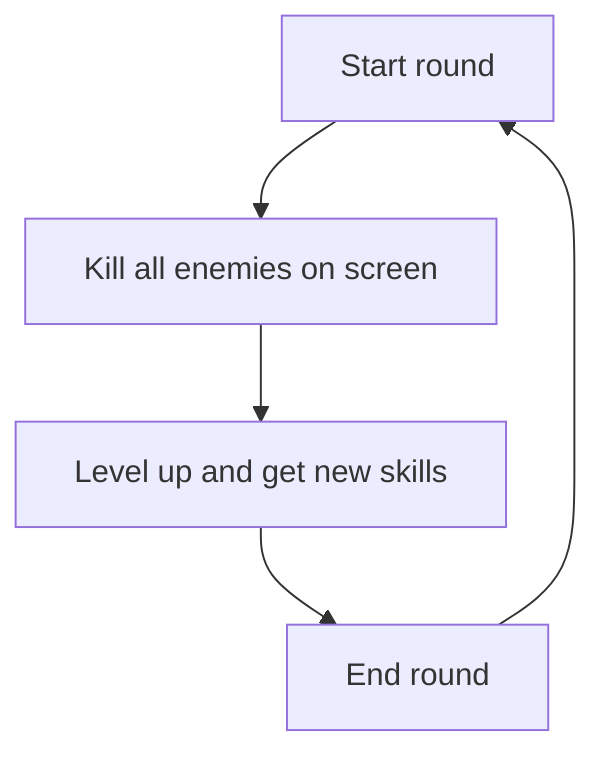
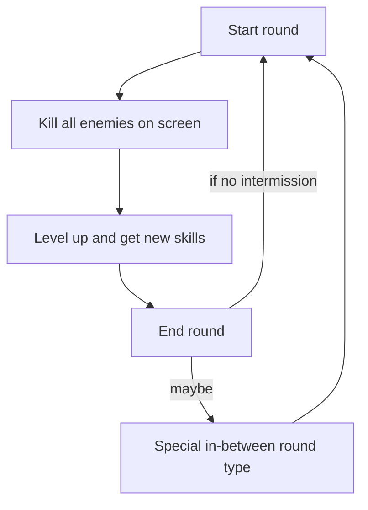

Recently I made [this post](/posts/new_project) where I talked about a new project idea I had.

Last sunday I started making it, and quickly noticed that I don't like it. I just don't want to make a daemon right now, maybe I will revive the idea sometime, but for now, I've got a new fun idea: a game!

# Table of contents
1. [The (first) concept](#the-first-concept)
2. [Making it an actual roguelike](#making-it-an-actual-roguelike)
    1. [In-between/intermission rounds](#in-betweenintermission-rounds)
    2. [Abilities instead of modifiers](#abilities-instead-of-)
    3. [More?](#more)

## The (first) concept
Long ago I thought (like really, I never did something, I just had the idea) about this game called "Kill the queen" (might that be a reference?), a very simple but fun concept. The game basically was a round-based roguelike with one sole objective that you can already predict: killing the queen. What queen? I don't know, the square queen or something like that. The queen spawned when you arrived to level 100.

To help you in the journey you had three modifiers, **but only three**. These modifiers basically served as abilities that changed the projectiles you shot or added some effect to them, for example a "cluster" modifier that made your projectile slower and bigger, and when it hits something it splits into 4 smaller and faster projectiles.

These modifiers were stackable, meaning that you could have two clusters that make the first projectile even bigger and slower but every projectile it splits into also splits into 4, or have cluster and explosive so the smaller projectiles explode on hit.

Modifiers were adquired by defeating a mini boss, which appears every 3-5 XP levels, and overall difficulty increases when you defeat a boss, which appears every 20 levels. When difficulty increases, rarity of modifiers you can get also does.

Visually, as I am not an artist, I wanted to make it just with basic shapes, like *Just Shapes & Beats*.

## Making it an actual roguelike.
In the old version the game was more arcade than roguelike: round after round of decimating enemies to get more XP. But, if I call the game a roguelike, why not make it an actual roguelike? So, I present some ideas that might make the game more enjoyable and replayable (but also harder to develop D:).

### In-between/intermission rounds
The original concept had this loop:

Which is okay, but makes it feel more like pong and less like Risk of Rain 2 (not saying I am trying to copy RoR2), plus all engagement has to come from the killing all enemies and leveling up parts, which means that if someone plays some rounds and those two things don't catch them then they'll never touch the game again.

So that's why I want to redesign it to this:

If the flowchart isn't clear enough:
1. Start a new round.
2. Main gameplay (using your skillset to clear the screen).
3. Either:
- Start an intermission round (I'll talk about types of intermission rounds later).
- Start a new normal round.

I.Rs (Intermission Round[s]) will always have a small-ish chance of appearing after every round (so yes, you could get I.Rs after every normal round if you are **REALLY** lucky).

They will also **always** appear after boss rounds.

There will be various types of I.Rs, for now they will be:
- **Chance altar**: gamble off a skin for a small chance to gain much better one, but a big one of loosing it completely.
- **Challenge room**: either start a new round or go to a challenge that gives you high rarity skills, you choose.

### Abilities instead of *"modifiers"*.
Modifiers were always passive, meaning that it was more of a vampire survivors type of thing. In the new concept I want to change modifiers to skills/abilities (most likely calling them skills in-game).

There are two types of skills: passive and active. Passive skills will change stats *passively* as long as the skill is in the skillset, while active skills must be explicitly activated by the player and give temporal advantages or special attacks.

Also, skills have various properties, this is the concept of a "skill card" I have:

This is an example of a skill card:

Let's analyze it!
- **Rarity**: each skill has a rarity value, as you progress you will get cards with more rarity, and cards with higher rarity are better than cards less rare.
- **Description**: do I have to explain this one? I mean, it's pretty obvious. Okay, okay, I will: the description briefly tells what the skill does.
- **Buffs & debuffs**: to balance the game, skills have buffs and debuffs. Buffs will **passively enchance** stats, while debuffs will **passively worsen** stats.
- **Damage type**: damage types are one of those things that, if I explain them right now, would make the blog post ultra long, because there is a lot to say about the design, so I will explain it briefly: each skill has a damage type, which can be neutral (or "normal" damage, basically no special effects, it's just damage), fire, electrical, among others. Enemies can be strong (or even immune) to some damages and weak to others.

### More?
There's so much more I want to comment, but if I did then the post would be too long (and I would also not be able to post it today), so I will give small updates [here](/projects/kill_the_queen) in the form of devlogs with new things I implement and new concepts I have.

**Let's hope this project goes well.**
