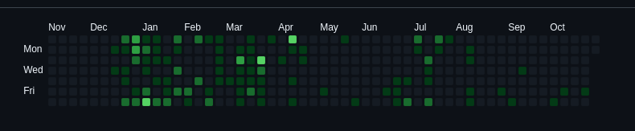

### New commits? In this economy?
So, I didn't make ANYTHING recently, like, just look at this:

I did **525** contributions this year, and **504** (yes, I calculated it) were made in the first half of the year. August, September and October are practically empty, that's **THREE MONTHS** with no shit done.

### What REALLY happened in those three months.
Well, abandoned projects!

What I did in those three months was starting a project, then either end up not liking it or seeing it's too ambitious, interstection that leads to the same path: abandoning that project.

### The idea.
There was a reason I didn't do anything, and that was a phenomenon I call "absolutely no ideas".

But then I had one: what if I make a simple self-hosted notion-like tool, but instead of just making it a kanban board or TODO list like any other, I make it more data-oriented?

I mean, it isn't *that* hard, but it is still pretty complicated, and it's also is a good learning project, as it has backend and frontend, frontend being the field that I have to practice the most.

By the way, this project will be documented in small blog posts, and, preferably, in a separate list of posts linked to it, if I figure out how to do that d:
