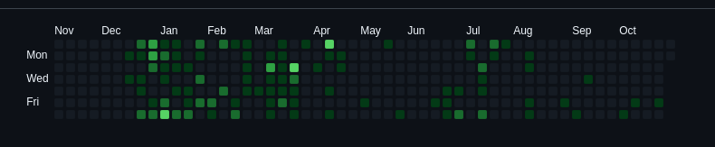

### New commits? In this economy?
So, I didn't make ANYTHING recently, like, just look at this:

I did **525** contributions this year, and **504** (yes, I calculated it) were made in the first half of the year. August, September and October are practically empty, that's **THREE MONTHS** with no shit done.

### What REALLY happened in those three months.
Well, abandoned projects!

What I did in those three months was starting a project, then either end up not liking it or seeing it's too ambitious, interstection that leads to the same path: abandoning that project.

### Will I ever make a new project?
Well, probably, but I need to find the idea, and if you have any project idea, [contact me](mailto:Nykenik24@proton.me).

